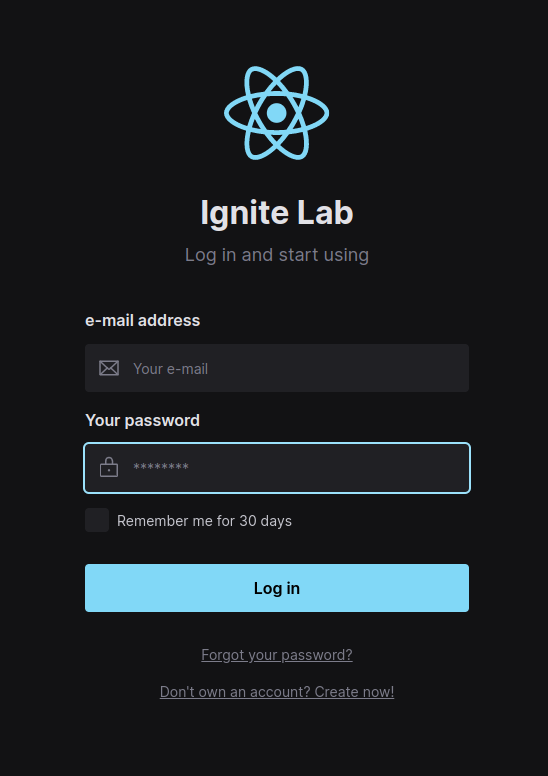

# Ignite Lab 03

This is a small project built using React and Vite. The main purpose is to
study some new concepts like Design Systems, StoryBook, Component documentation
and how to apply it into frontend project

  

## Concepts studied
* Design Systems
* Storybook
* Component documentation
* Component testing

## Accessing components and pages storybooks
You can access the storybook files through this link: https://aleodoni.github.io/ignite-lab-design-system/
